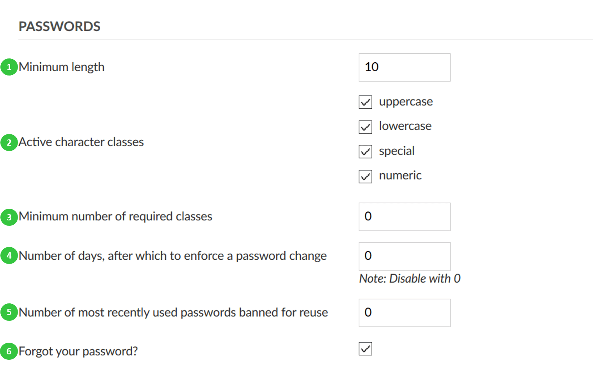
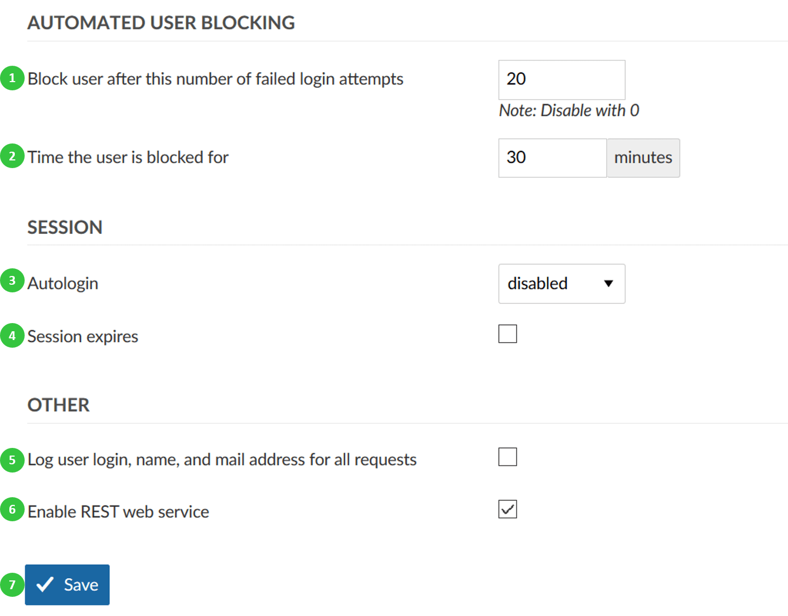

---
sidebar_navigation:
  title: Settings
  priority: 990
description: Authentication settings in OpenProject.
keywords: authentication settings
---
# Authentication settings

To adapt general system **authentication settings**, navigate to *Administration -> Authentication* and choose -> *Settings*.

You can adapt the following under the authentication settings:

## General authentication settings

1. Select if the **authentication is required** to access OpenProject. **Watch out**: If you un-tick this box your OpenProject instance will be visible to the general public without logging in. The visibility of individual projects depends on [this setting](../../../user-guide/projects/#set-a-project-to-public). 

2. Select an option for **self-registration**. Self-registration can either be **disabled**, or it can be allowed with the following criteria:

   a) **Account activation by email** means the user receives an email and needs to confirm the activation.

   b) **Manual account activation** means that a system administrator needs to manually activate the newly registered user.

   c) **Automatic account activation** means that a newly registered user will automatically be active.

3. Define if the **email address should be used as login** name.

4. Define after how many days the **activation email sent to new users will expire**. Afterwards, you will have the possibility to [re-send the activation email](../../users-permissions/users/#resend-user-invitation-via-email) via the user settings.

## Define a registration footer for registration emails

You can define a footer for your registration emails under -> *Administration* -> *Authentication* -> *Settings*.

1. Choose for which **language** you want to define the registration footer.
2. Enter a **text for the registration footer**.

## Configure password settings

You can change various settings to configure password preferences in OpenProject.

1. Define the **minimum password length**.
2. Define the password strength and select what **character classes are a mandatory part of the password**.
3. Define the **minimum number of required character classes**.
4. Define the number of days, after which a **password change should be enforced**.
5. Define the **number of the most recently used passwords that a user should not be allowed to reuse**.
6. Activate the **Forgot your password.** This way a user will be able to reset the own password via email.

## Other authentication settings

There can be defined a number of other authentication settings.

1. Define the number of failed **login attempts, after which a user will be temporarily blocked**.
2. Define the **duration of the time, for which the user will be blocked after failed login attempts**.
3. Enable or disable the **autologin option**. This allows a user to remain logged in, even if he/she leaves the site. If this option is activated, the “Stay signed in” option will appear on the login screen to be selected.
4. Activate the **session expiration option**. If you select this option, an additional field will open, where you will be able to define the **inactivity time duration before the session expiry**.
5. Define to **log user login, name, and mail address for all requests**.
6. **Enable REST web service**. This setting allows users to access the OpenProject API using an API token created from the users "My account" page.
7. Do not forget to **save** your changes.

